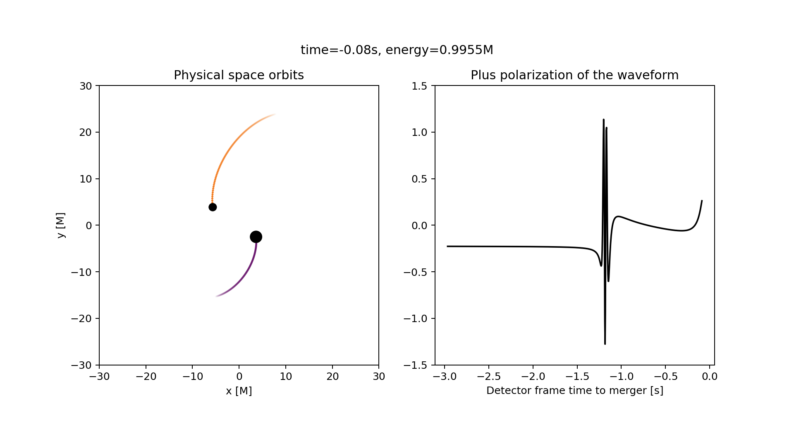

A video of black holes orbiting and merging, 
starting from their EOB description!

Videos made with this can be found at the following links:

- [Dynamical capture for GW190521](https://www.youtube.com/watch?v=xRF-Gc0voik)
- [Quasi-circular GW190521](https://www.youtube.com/watch?v=8FNCC3WeGyc)



## Usage

Information about the binary is contained in the `Event` class 
(within `maximum_likelihood_scenario.py`).

Once you define an event, you can plot it with the `plot_event` function
within `plots.py`.

This will generate a video of the EOB evolution brought into physical coordinates,
also showing the corresponding gravitational waveform.

The project is mostly targeted at visualizing the event GW190521,
which was [recently reanalyzed showing that it was likely a dynamical capture](https://www.nature.com/articles/s41550-022-01813-w).

## Technical info / installation

This was tested with `python3.11`, and the necessary packages
are:
`numpy astropy matplotlib scipy ffmpeg-python tqdm`

Also, you need `TEOBResumS`. To install the correct version, do:

```bash
git clone https://bitbucket.org/eob_ihes/teobresums
cd teobresums
git checkout eccentric.v0_a6c_c3_circularized
git cherry-pick e8cb333
cd Python
make
```

because a function we need is not in the eccentric model they used

Remember to 
```
export PYTHONPATH=$PYTHONPATH:~/path/to/teobresums/Python
```
